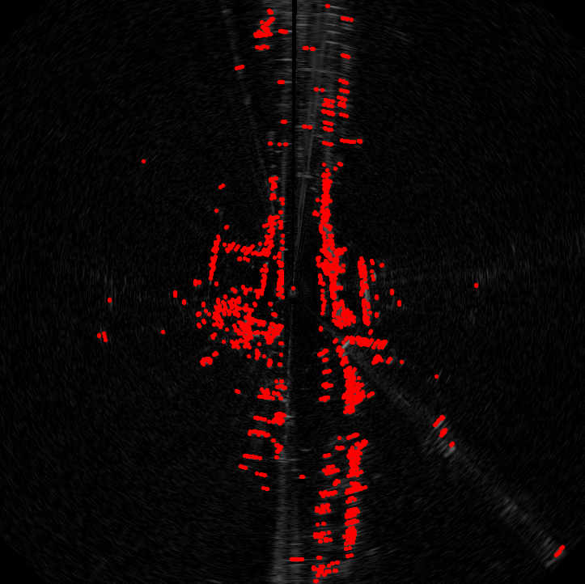
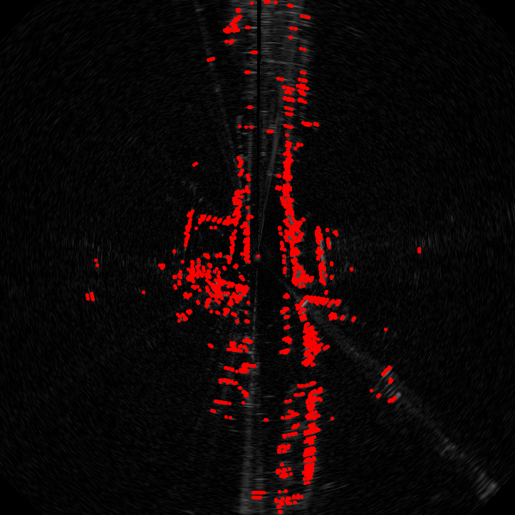
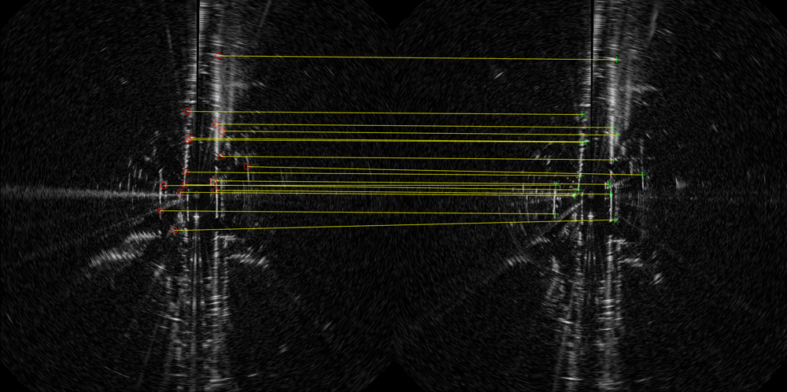
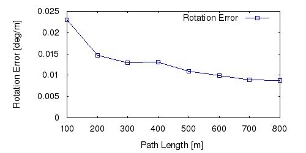
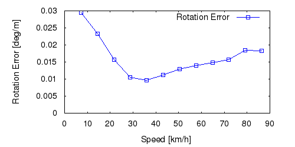
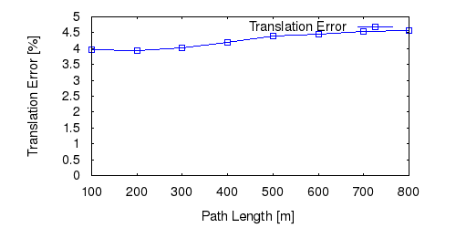
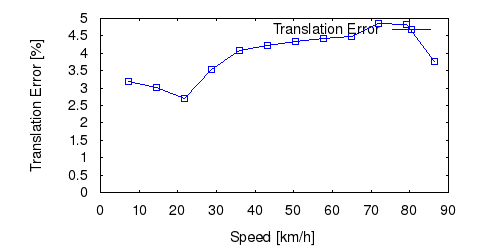
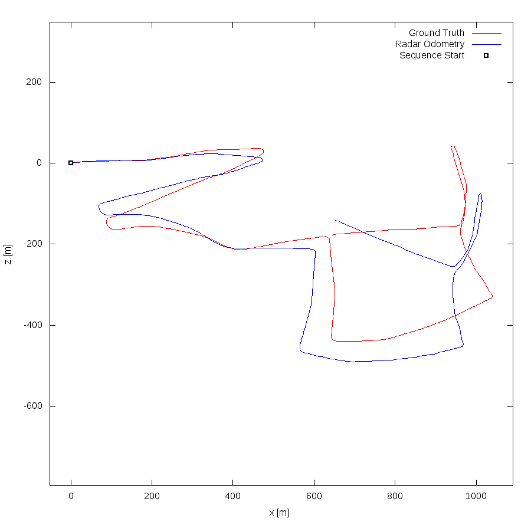

# Radar Odometry

This repo contains radar odometry code for paper [Precise Ego-Motion Estimation with Millimeter-Wave Radar
under Diverse and Challenging Conditions](https://www.google.com/url?sa=t&rct=j&q=&esrc=s&source=web&cd=&cad=rja&uact=8&ved=2ahUKEwji6qLu88LuAhWjFTQIHW85BqMQFjACegQIARAC&url=https%3A%2F%2Fori.ox.ac.uk%2Fmedia%2F5535%2F2018icra_cen.pdf&usg=AOvVaw3V3-M2y-G6erdox6S1aw6j). For odometry experiments, we use the [Oxford Radar Robotcar Dataset](https://oxford-robotics-institute.github.io/radar-robotcar-dataset/). 

## Feature Extraction
frame 1             |  frame 5
:-------------------------:|:-------------------------:
  |  

## Data Association

## Radar Odometry Performance(test on data collected on 10/01/2019)
Rotation Error vs Path Length             |  Rotation Error vs Speed
:-------------------------:|:-------------------------:
  |  

Translation Error vs Path Length             |  Translation Error vs Speed
:-------------------------:|:-------------------------:
  |  

### Ground truth and Componded Trajectory Estimation

